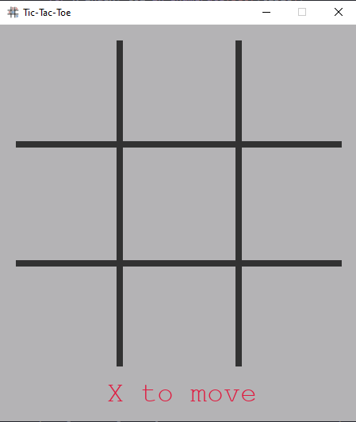
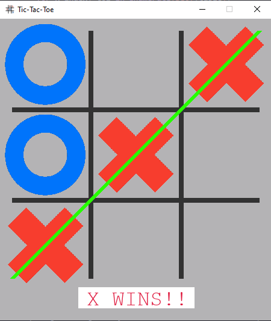
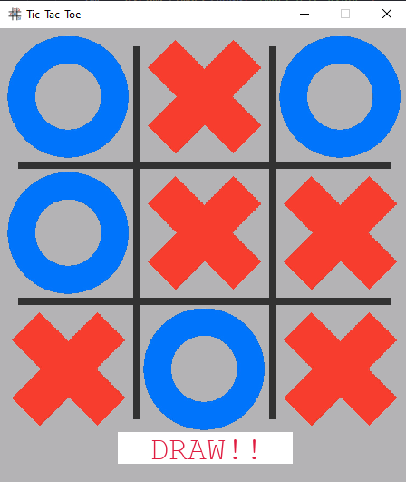

## Tic-Tac-Toe with pygame

The old and good tic-tac-toe game :smiley:

**The visual:**

  
| The game   | The winner   | It's a tie!   |
|----------|:----------|:----------|
|  |  |  |

I built one tic-tac-toe game before. That one allows the player to play against the machine, and it runs only on the terminal. This time I decided to go further and build a simple (but beautiful) board and give the chance for the players to play against each other.

In order to built this, I used [pygame](https://www.pygame.org/news), a python framework for (as the name suggests) build games.

  
  
  

To code this was a interesting challenge, and the final structure ended up like this:
- defined the dimentios to the game window
- to build a class defining the size of the board, each cell, the players, etc
- to build various functions to define: who's turn it is, who wins, to check if anyone wins at all, etc

Build this using pygame, allows everyone to play, and it is visiualy nicer

## Jogo da Velha com pygame

O bom e velho jogo da velha :smiley: (PT-BR)

Eu constrí um jogo da velha com python antes. Aquela versão, permite que o jogador jogue contra a máquina e roda apenas no terminal. Desta vez, eu decidi ir um pouco além e construir um simples (mas bonito) tabuleiro e dar a chance para os jogadores jogarem uns contra os outros.

Para construit, eu usei o [pygame](https://www.pygame.org/news), uma biblioteca do python para (como o nome sugere) construção de jogos.

Construir esse código foi um desafio interessante e a estrutura final ficou assim:
- definir as dimensões da janela do game
- construir uma classe responsável por tudo: tamanho do tabuleiro, tamanho das células, os jogadores, etc
- construir várias funções para definir: de qual jogador é a vez, quem venceu, se há um vencedor de fato, etc

Usar a pygame permite que todos joguem, além de proporcionar um visual mais agradável para os jogadores

